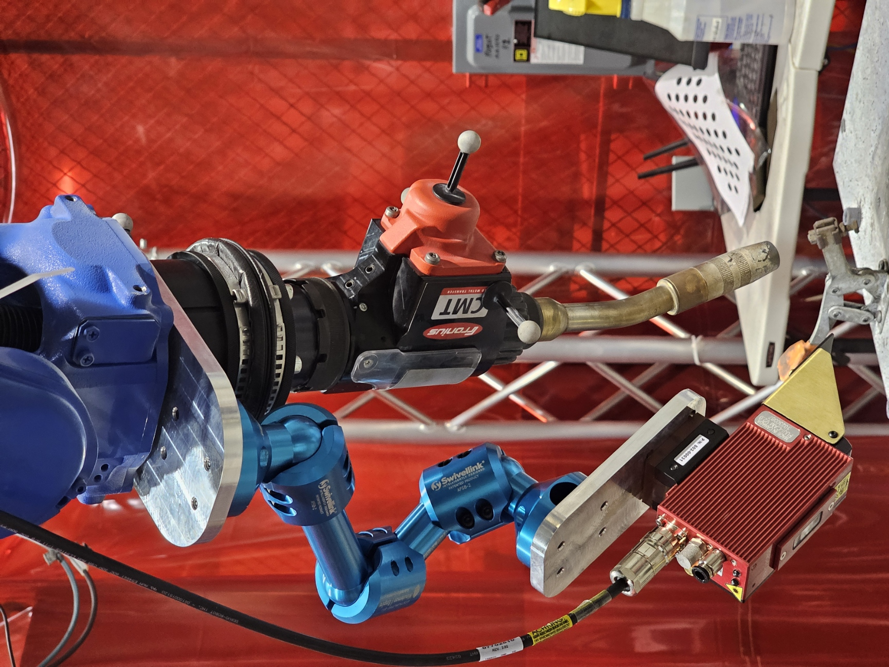

# Servo Robot FujiCAM Installation

## Disconnect Water Cooling Connection
Unplug the connector attached to the  robot arm.

## Disconnect Pipe

Unplug the pipe on attached to the robot arm.

## Disconnect Torch Magnetic Connection

Bend the torch to disconnect the magnetic connection, then unscrew.

**BE SURE TO PUT A BARRIER BETWEEN MAGNETIC PLATE AND TORCH**

## Unscrew Pipe Lockers

Unscrew the flathead pipe locker.

## Pull Pipe

Pull the pipe all the way.

## Unscrew the Mounting Piece

## Install the FujiCAM Mounting Piece

## Put Everything Back

Use zipties to secure the FujiCAM cable along the robot arm.

