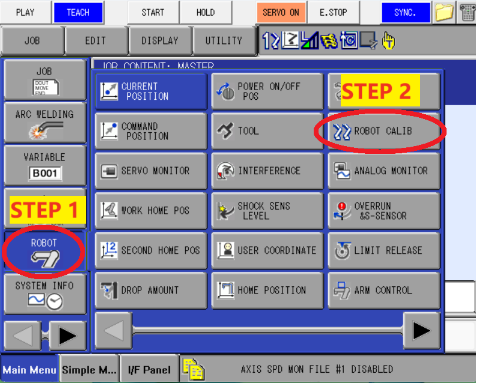
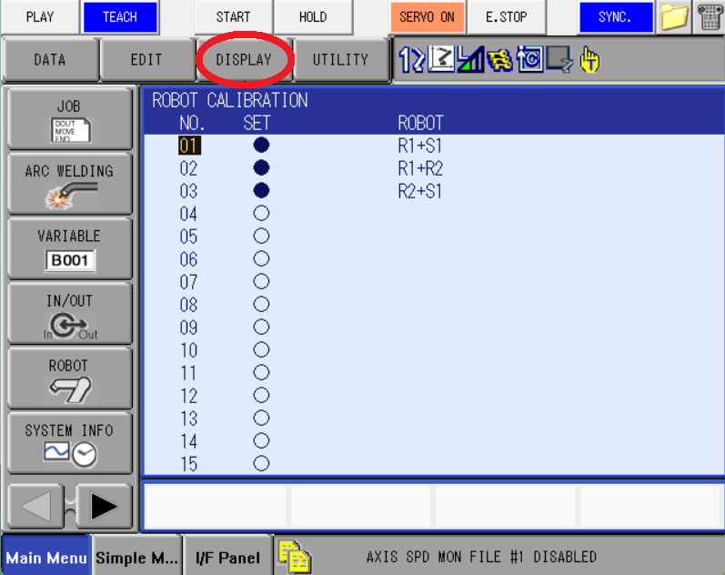
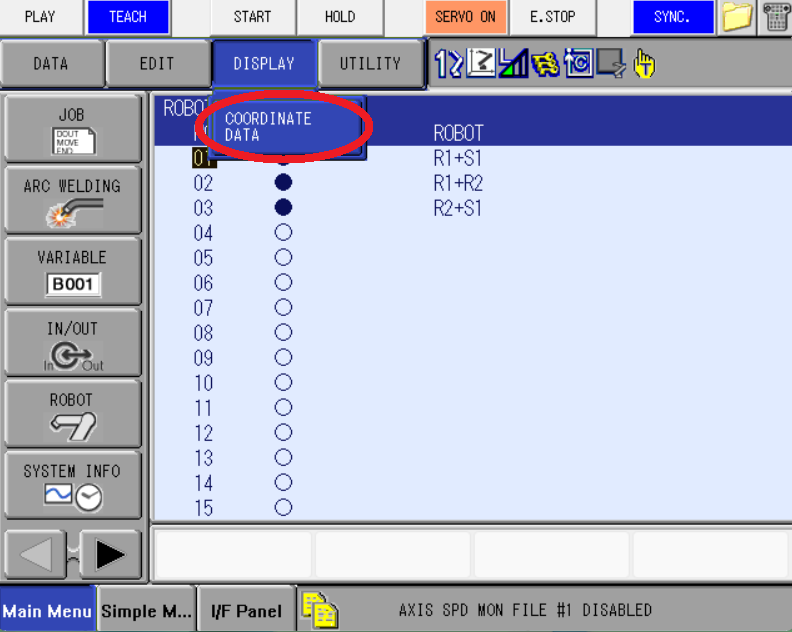
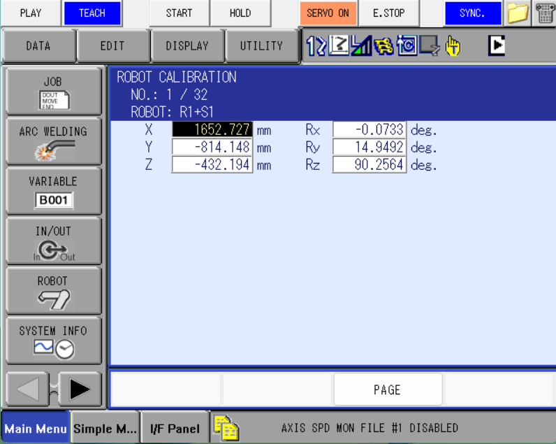
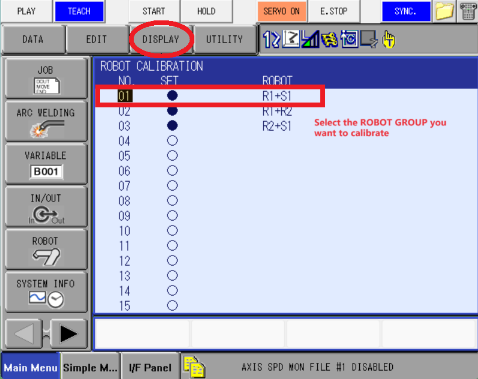
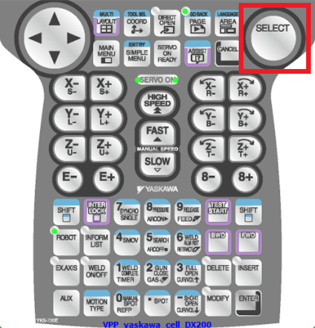
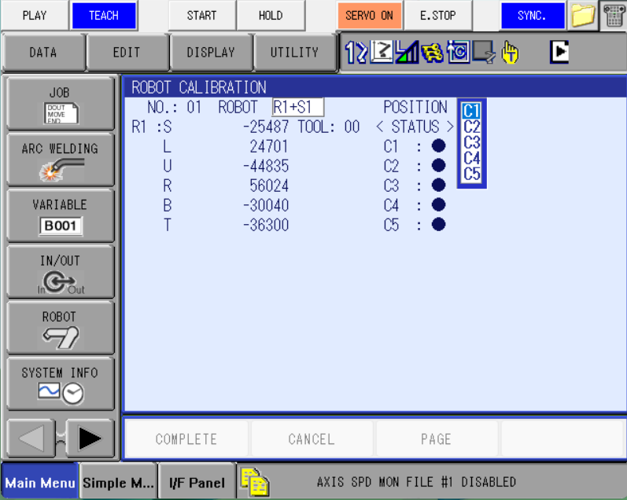
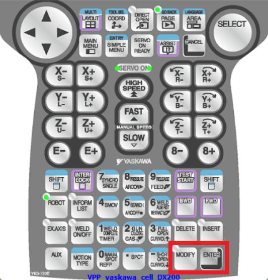
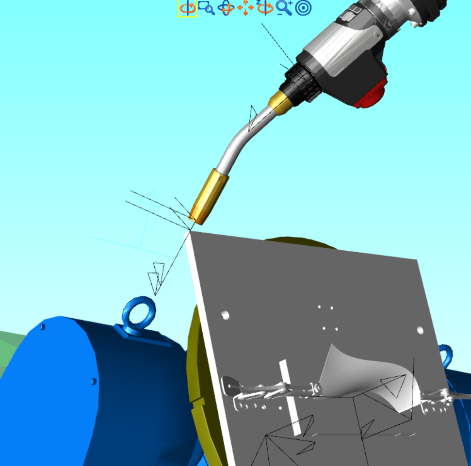
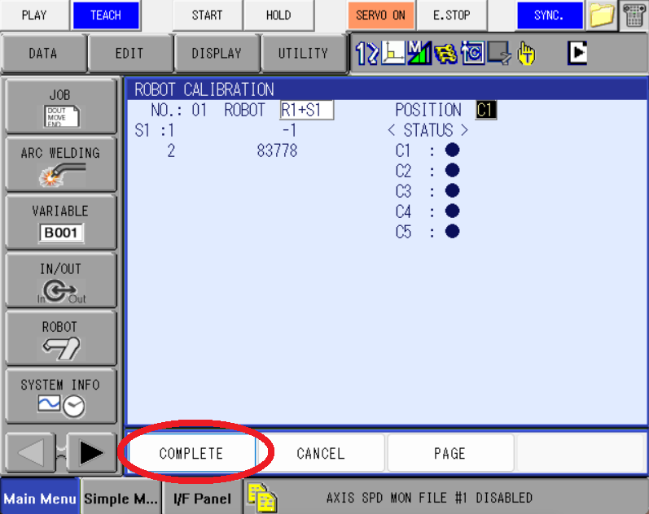

# Robot Calibration (On Teach Pandant)
## Check robot calibration data from teach pandant
* Click [ROBOT] on left menu, and select [ROBOT CALIB]

* Click [DISPLAY] and select [COORDINATE DATA]

* The data shown on the screen will be robot calibrated configuration:

## Robot calibration
* Use [select] on teach pandant and select the robot group to calibrate:

* Use `5 points rule` for calibration:
Point the TCP of robot#1 to a reference point on robot#2, and keep them pointing each other for all 5 points:

Jog C1, C2, C3 with fixing 2nd axis of robot#2.
Jog C3, C4, C5 with fixing 1st axis of robot#2.
Use [MODIFY] + [ENTER] to adjust C1 - C5.

Click [COMPLETE] to finish robot calibration, if errors happen, follow the error instruction to re-adjust C1 - C5.

