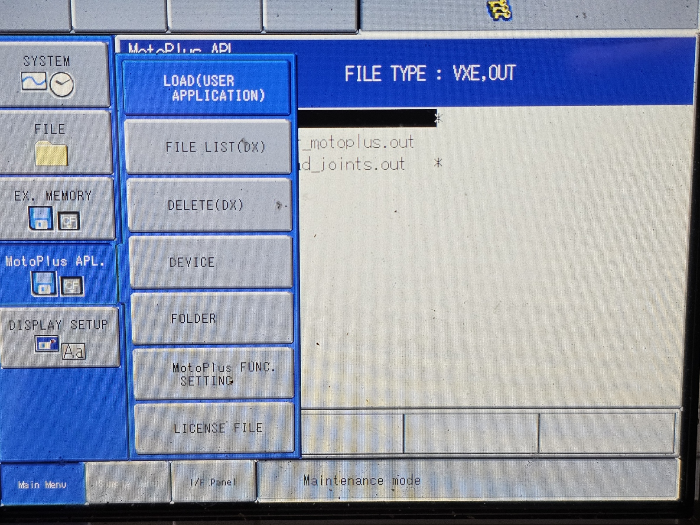
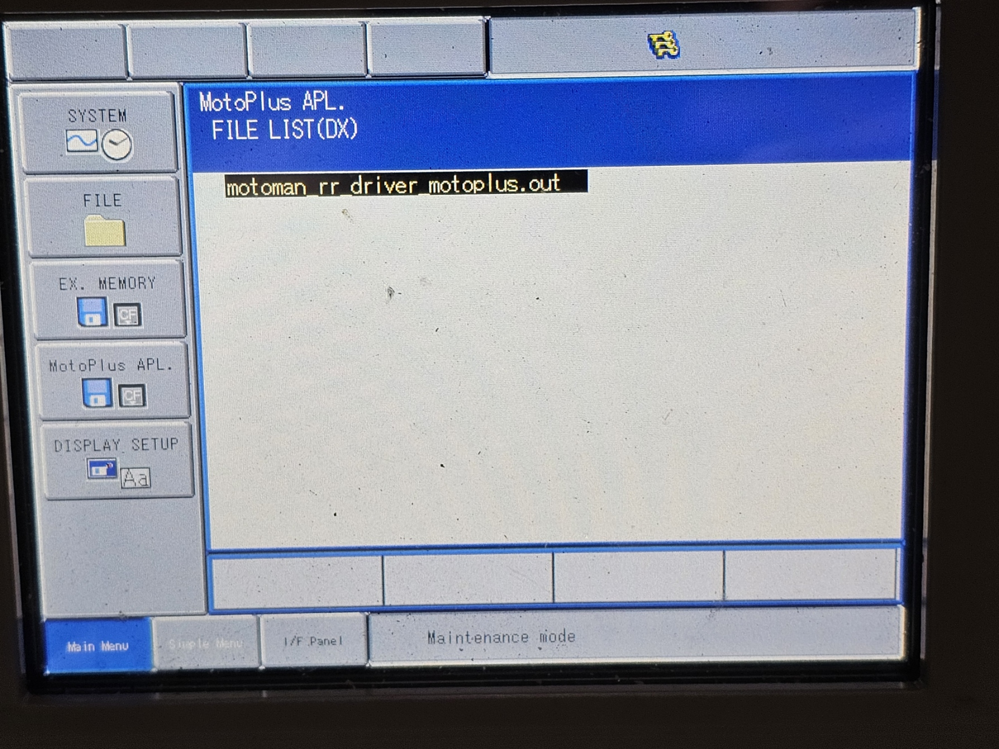
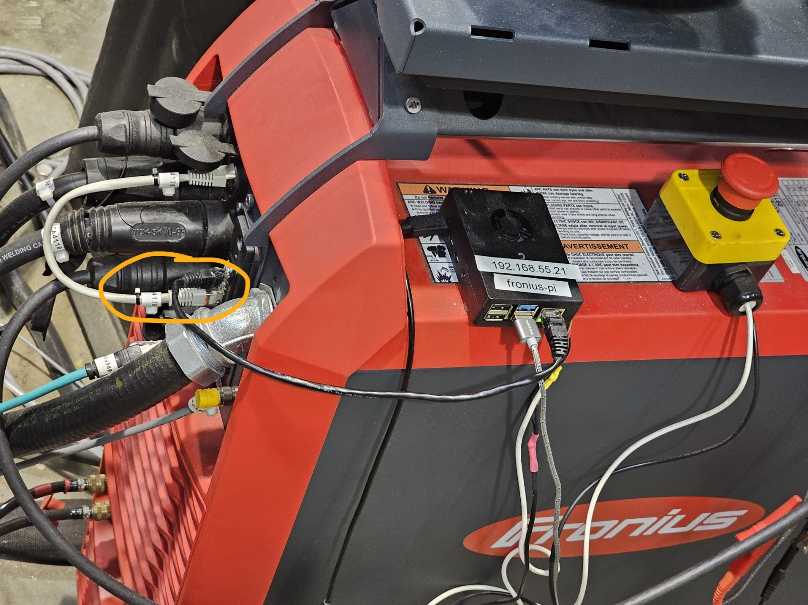

# MotoPlus Streaming via RobotRaconteur

## Load MotoPlus Program

Copy `motoman_rr_driver_motoplus.out` to the teachpendant USB flash drive, and plug it back.
Boot into Maintenance Mode, go to {MotoPlus APL.} -> {LOAD(USER APPLICATION)}, choose `motoman_rr_driver_motoplus.out` and hit *Enter*.



Verify the Motoplus program is loaded by {MotoPlus APL.} -> {FILE LIST(DX)}, make sure `motoman_rr_driver_motoplus.out` is there.




## Set up RR Driver

`ping` the DX200 controller from PC first to verify direct connection. Acquire and install the proprietary RR driver (>=Python3.11).
```
python311 -m motoman_robotraconteur_driver --robot-info-file=rpi_waam_testbed.yml --robot-ip-address=192.168.1.31
```

## Set up Fronius Pi Control

Motoplus does not handle Fronius welding control, a separate Raspberry Pi is dedicated for this purpose.



Unplug the green Ethernet from DX200 to Fronius, and plug in the Ethernet from Pi to Fronius (shown in yellow circle). `ping` the Fronius to verify direct connection.

A dedicated **E-stop** is wired into Pi's GPIO, this function is embeded in my modified [Fronius Driver for Pi](https://github.com/hehonglu123/fronius_robotraconteur_driver).

## Running the Robot

A set of helper function for streaming is in [StreamingSend](https://github.com/hehonglu123/convergent_manufacturing_utils/blob/main/src/StreamingSend/StreamingSend.py), packeged within [convergent_manufacturing_utils](https://github.com/hehonglu123/convergent_manufacturing_utils).

Refer to [Spiral Cylinder Welding](https://github.com/hehonglu123/Welding_Motoman/blob/main/weld/streaming/cylinder_exp/weld_cylinder_spiral.py) as example.